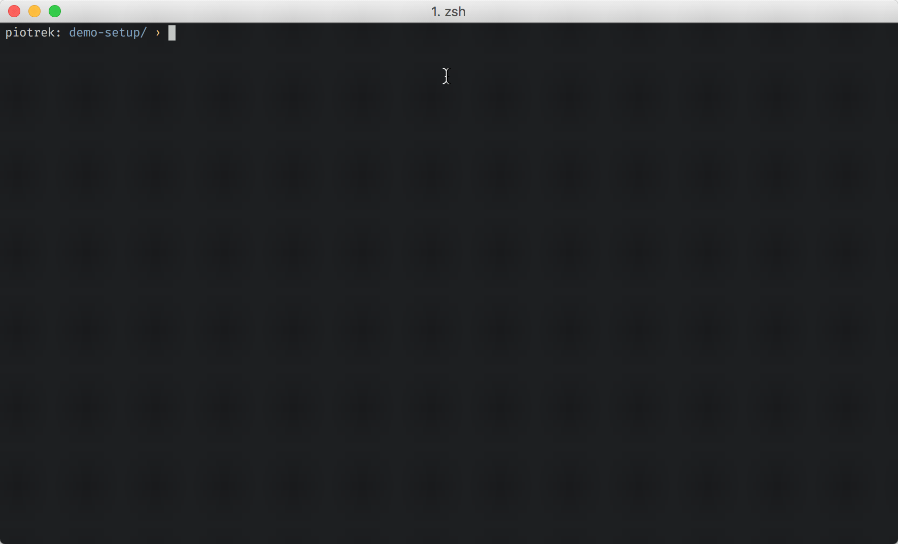

# 👨‍🏭 Welder

Welder allows you to set up a Linux server with plain shell scripts.

I wrote it out of frustration with Ansible. Ansible is an amazing and powerful
tool, but for my needs it's just too much. 90% of the time all I need is:

~~~ sh
ssh -t user@example.com "$(< ./my-setup-script.sh)"
# or:
ssh -t user@example.com "$(cat ./my-setup-script.sh)"
~~~

In most basic terms, that's what welder does.

But there's some more.

## Features

Welder allows you to:

* execute local shell scripts on the server via ssh
* organize your scripts into a logical set of reusable modules
* set up a server with a single command (`welder run <playbook>`)
* run one-off shell scripts (`welder run-script <user@example.com> <path/to/script.sh>`)
* use [liquid](https://github.com/Shopify/liquid) templates for configuration
  (optional)
* enter `sudo` password just once per playbook

See [`welder-contrib`](https://github.com/pch/welder-contrib) for some example
modules.

### Directory structure

An example directory structure:

~~~ sh
├── modules
│   ├── nginx
│   │   ├── files
│   │   │   ├── nginx.conf
│   │   └── setup.sh
│   ├── rails
│   │   ├── files
│   │   │   ├── nginx
│   │   │   │   ├── site.conf.liquid
│   │   │   ├── systemd
│   │   │   │   ├── puma.service.liquid
│   │   │   │   └── sidekiq.service.liquid
│   │   │   └── rbenv-vars.liquid
│   │   └── setup.sh
│   ├── system
│   │   ├── files
│   │   │   ├── 10periodic
│   │   │   └── 50unattended-upgrades
│   │   └── setup.sh
├── config.yml
├── vault.yml
├── vault.yml.gpg
└── my-site.yml
~~~

Example playbook:

~~~ yaml my-site.yml
ssh_url: admin@example.com
ssh_port: 22  # Optional (default: 22)

shared_path: ../shared # optional

# List of modules to execute
modules:
  - system
  - firewall
  - rbenv
  - nginx
  - rails
~~~

### Templates

Welder uses [liquid](https://github.com/Shopify/liquid) for templates. It's
mostly compatible with ansible's `*.j2` files:

~~~ lua
# modules/rails/files/nginx-site.conf.liquid
upstream thumbor {
  
      server 127.0.0.1:{{ port }};
  
}

server {
    listen 80;

    server_name {{ thumbor_host }};
    include snippets/ssl-{{ app_domain }}.conf;

    location / {
        proxy_pass http://thumbor;
        proxy_set_header Host $host;
        proxy_set_header X-Forwarded-For $proxy_add_x_forwarded_for;
    }
}
~~~

### config.yml

The `config.yml` file will be used to provide variables for your `*.liquid`
templates:

~~~ yaml
# example config.yml
app_name: example
app_domain: example.com

ruby_version: "2.4.0"
ruby_deploy_user: "deploy"
rails_env: production

app_dir: "/var/www/example"
letsencrypt_web_dir: "/var/www/letsencrypt"

thumbor_host: images.example.com
thumbor_instances:
  - 8000
  - 8001
  - 8002
  - 8003
~~~

During the compilation phase, `config.yml` is turned into a bash-compatible
format and uploaded to the server:

~~~ sh
# compiled config-variables file
cfg_app_name='example'
cfg_app_domain='example.com'
cfg_ruby_version='2.4.0'
cfg_ruby_deploy_user='deploy'
cfg_rails_env='production'
cfg_app_dir='/var/www/example'
cfg_thumbor_host='images.example.com'
cfg_thumbor_instances=(8000 8001 8002 8003)
~~~

You can then `source` it in your setup scripts:

~~~ sh
# modules/example/setup.sh
source setup/config-variables

echo $cfg_app_name
echo $cfg_app_dir
# (notice the $cfg_ prefix)
~~~

**NOTE**: In order for this to work reliably, `config.yml` has to be fairly flat
and simple - nested hashes are not supported.

### Shared Modules

If you want to avoid duplicating modules across different projects, you can
specify `shared_path` in your playbook YML file:

~~~ yaml my-site.yml
ssh_url: admin@example.com

shared_path: ../shared

modules:
  - system
  - firewall
~~~

In the example above, `../shared` directory should contain `modules` directory.

### Security Notes

Don't store any sensitive information (passwords etc.) in `config.yml`. If you
want to keep passwords in git, create a `vault.yml` file, add it to .gitignore
and store the encrypted version in revision control:

~~~ sh
# encrypt & decrypt vault.yml using your gpg key
gpg --encrypt --recipient 'John Doe' vault.yml
gpg --decrypt --output vault.yml vault.yml.gpg

# encrypt & decrypt using a passphrase (no private/public key needed)
gpg --symmetric --cipher-algo aes256 vault.yml
gpg --decrypt --output vault.yml --cipher-algo aes256 vault.yml.gpg
~~~

For more information on how to set up GPG/PGP, see [this excellent tutorial][gpg].

[gpg]: https://robots.thoughtbot.com/pgp-and-you

Think of this as just another level of security for your private git repos. You
probably don't want to store the encrypted vault in a public repo.

#### sudo

Because `sudo` password is passed as an argument to the
[`expect script`](https://github.com/pch/welder/blob/master/libexec/priv/run-ssh-script),
it will be visible in the process list on your local computer. This could be
an issue if you're using a shared machine to run setup scripts.

### Example setup script

~~~ sh
# modules/nginx/setup.sh

set -xeu # 'u' will give you warnings on unbound config variables

[[ -f setup/config-variables ]] && source setup/config-variables

sudo add-apt-repository -y ppa:nginx/stable
sudo apt-get update && sudo apt-get install -y nginx

sudo service nginx start

sudo cp setup/modules/nginx/files/nginx.conf /etc/nginx/nginx.conf

# Disable default site
if [ -f /etc/nginx/sites-enabled/default ]; then
  sudo rm /etc/nginx/sites-enabled/default
fi

sudo service nginx restart
~~~

## Usage

~~~ sh
welder run my-site # runs the playbook defined in my-site.yaml
~~~

The `run` script will compile templates and configs, upload them to the server
(to `/home/username/setup`) and then it will ask you for the `sudo` password.
After that, it will execute all `*.sh` scripts from the modules listed in the
playbook file.

Additional commands:

~~~ sh
welder compile <playbook>  # compiles templates and uploads them to the server
welder cleanup <playbook>  # remove compiled files from the server
~~~

If you want to run a single `*.sh` script on the server, you can use this:

~~~ sh
welder run-script <user@example.com> <path/to/script.sh>
~~~

**NOTE**: the `run-script` command does not compile templates. It merely wraps
`ssh -t user@example.com "$(< ./path/to/script.sh)"`. If you want access to
templates and config, run `welder compile <playbook>` first and
`welder cleanup <playbook>` when you're done.

## Installation

1. Install dependencies

   Welder requires expect, rsync and ruby. Ruby is used mainly as a
   convenient way to parse YAML configuration files.

   Optionally, if you'd like to use the templating feature,
   you need to install [liquid](https://github.com/Shopify/liquid) gem:

    ~~~ sh
    $ gem install liquid
    ~~~

2. Check out welder into `~/Code/welder` (or whatever location you prefer):

    ~~~ sh
    $ git clone https://github.com/pch/welder.git ~/Code/welder
    ~~~

2. Add `~/Code/welder/bin` to your `$PATH` for access to the `welder`
   command-line utility.

    ~~~ sh
    $ echo 'export PATH="$PATH:$HOME/Code/welder/bin"' >> ~/.bash_profile
    ~~~

    **Ubuntu Desktop note**: Modify your `~/.bashrc` instead of `~/.bash_profile`.

    **Zsh note**: Modify your `~/.zshrc` file instead of `~/.bash_profile`.

3. Restart your shell so that PATH changes take effect. (Opening a new
   terminal tab will usually do it.) Now check if welder was set up:

    ~~~ sh
    $  which welder
    /Users/my-user/Code/welder/bin/welder
    ~~~

## Caveats

Since welder allows you to run **anything** on the server, you should use it
with caution. It won't protect you from screw-ups, like
`rm -rf "/$undefined_variable"`.

Use at your own risk.

## Known Issues / Limitations

* YAML config doesn't support nested values
* Ruby dependency should be optional
